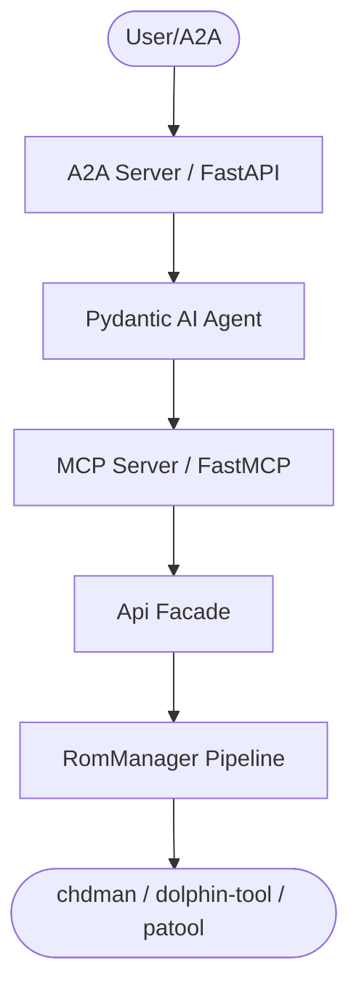
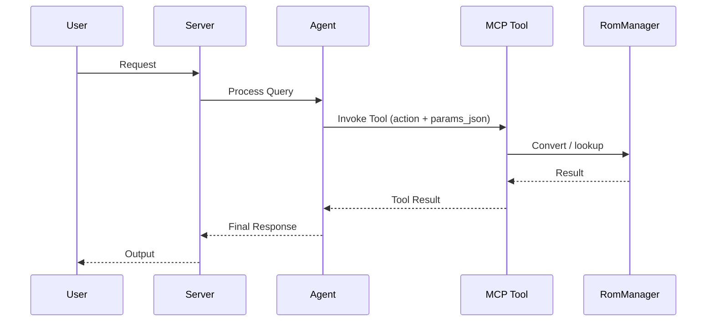

# AGENTS.md

> Claude Code loads this file via `CLAUDE.md` (`@AGENTS.md` import) — the two stay
> in sync. Edit **this** file, not `CLAUDE.md`.

## Tech Stack & Architecture
- Language/Version: Python 3.11+
- Core Libraries: `agent-utilities`, `fastmcp`, `pydantic-ai`, `tqdm`
- External binaries (runtime, for conversion): `chdman` (mame-tools), `dolphin-tool`, `7z`/`patool`
- Key principles: Functional patterns, Pydantic for data validation, asynchronous tool execution.
- Architecture:
    - `rom_manager/rom_manager.py`: The real ROM conversion pipeline (`RomManager`, CLI `rom_manager()`).
    - `rom_manager/mcp_server.py`: MCP server entry point and tool registration.
    - `rom_manager/mcp/`: Action-routed MCP tool modules (`mcp_conversion.py`, `mcp_game_codes.py`).
    - `rom_manager/agent_server.py`: Pydantic-AI agent server.
    - `rom_manager/api_client.py`: Honest local facade (`Api`) over `RomManager`.
    - `rom_manager/auth.py`: Local/no-op config factory (`get_client`).

### Architecture Diagram

### Workflow Diagram

## Commands (run these exactly)
# Installation
pip install .[all]

# Quality & Linting (run from project root)
pre-commit run --all-files

# Execution Commands
# rom-manager        -> CLI converter (rom_manager.rom_manager:rom_manager)
# rom-manager-mcp    -> MCP server (rom_manager.mcp_server:mcp_server)
# rom-manager-agent  -> A2A agent (rom_manager.agent_server:agent_server)

## Project Structure Quick Reference
- CLI / Core Pipeline → `rom_manager/rom_manager.py`
- MCP Entry Point → `rom_manager/mcp_server.py`
- Agent Entry Point → `rom_manager/agent_server.py`
- Source Code → `rom_manager/`

## Code Style & Conventions
**Always:**
- Use `agent-utilities` for common patterns (e.g., `create_mcp_server`, `create_agent_server`).
- Define input/output models using Pydantic (`rom_manager/models.py`).
- Include descriptive docstrings for all tools (used as LLM tool descriptions), with the `CONCEPT:ROM-*` id.
- Check for optional/native dependencies (e.g. `patool`) using `try/except ImportError` and emit an install hint.

## Concepts
- `CONCEPT:ROM-001` — ROM Conversion (tag `conversion`)
- `CONCEPT:ROM-002` — Game Codes / Naming (tag `game-codes`)

See `docs/concepts.md` for the registry and cross-project references.

## Dos and Don'ts
**Do:**
- Run `pre-commit` before pushing changes.
- Preserve the real conversion pipeline — wrap `RomManager`, do not break it.
- Keep heavy/native deps (`patool`) in optional extras and lazily imported.

**Don't:**
- Add build-heavy libs to core `dependencies` in `pyproject.toml`.
- Hardcode secrets; there are no credentials for this local tool.
- Modify `agent-utilities` or `universal-skills` from within this package.

## Safety & Boundaries
**Always do:**
- Recommend backing up ROMs before destructive (`clean_origin_files`) operations.
- Verify `chdman` / `dolphin-tool` are installed before conversion.

**Never do:**
- Commit `.env` files or secrets.
- Write scratch/temp/debug files at the repository root.

## When Stuck
- Propose a plan first before making large changes.
- Check `agent-utilities` documentation for existing helpers.

## ⛔ Keep the Repository Root Pristine — No Scratch / Temp / Debug Files

The repository ROOT must contain only canonical project files (packaging, config,
docs, lockfiles). Put experiments in `~/workspace/scratch/` and command output in
`~/workspace/reports/`; tests go in `tests/` (pytest). Run `git status` before
finishing to confirm no stray root files were added.
