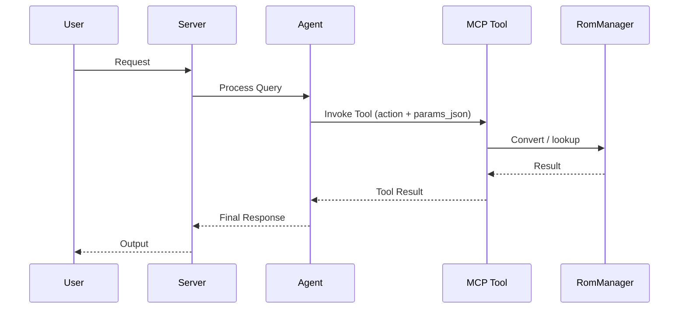

# AGENTS.md

> Claude Code loads this file via `CLAUDE.md` (`@AGENTS.md` import) — the two stay
> in sync. Edit **this** file, not `CLAUDE.md`.

## Tech Stack & Architecture
- Language/Version: Python 3.11+
- Core Libraries: `agent-utilities`, `fastmcp`, `pydantic-ai`, `tqdm`
- External binaries (runtime, for conversion): `chdman` (mame-tools), `dolphin-tool`, `7z`/`patool`
- Key principles: Functional patterns, Pydantic for data validation, asynchronous tool execution.
- Architecture:
    - `rom_manager/rom_manager.py`: The real ROM conversion pipeline (`RomManager`, CLI `rom_manager()`).
    - `rom_manager/mcp_server.py`: MCP server entry point and tool registration.
    - `rom_manager/mcp/`: Action-routed MCP tool modules (`mcp_conversion.py`, `mcp_game_codes.py`).
    - `rom_manager/agent_server.py`: Pydantic-AI agent server.
    - `rom_manager/api_client.py`: Honest local facade (`Api`) over `RomManager`.
    - `rom_manager/auth.py`: Local/no-op config factory (`get_client`).

### Architecture Diagram


### Workflow Diagram


## Commands (run these exactly)
# Installation
pip install .[all]

# Quality & Linting (run from project root)
pre-commit run --all-files

# Execution Commands
# rom-manager        -> CLI converter (rom_manager.rom_manager:rom_manager)
# rom-manager-mcp    -> MCP server (rom_manager.mcp_server:mcp_server)
# rom-manager-agent  -> A2A agent (rom_manager.agent_server:agent_server)

## Project Structure Quick Reference
- CLI / Core Pipeline → `rom_manager/rom_manager.py`
- MCP Entry Point → `rom_manager/mcp_server.py`
- Agent Entry Point → `rom_manager/agent_server.py`
- Source Code → `rom_manager/`

## Code Style & Conventions
**Always:**
- Use `agent-utilities` for common patterns (e.g., `create_mcp_server`, `create_agent_server`).
- Define input/output models using Pydantic (`rom_manager/models.py`).
- Include descriptive docstrings for all tools (used as LLM tool descriptions), with the `CONCEPT:ROM-*` id.
- Check for optional/native dependencies (e.g. `patool`) using `try/except ImportError` and emit an install hint.

## Concepts
- `CONCEPT:ROM-001` — ROM Conversion (tag `conversion`)
- `CONCEPT:ROM-002` — Game Codes / Naming (tag `game-codes`)

See `docs/concepts.md` for the registry and cross-project references.

## Dos and Don'ts
**Do:**
- Run `pre-commit` before pushing changes.
- Preserve the real conversion pipeline — wrap `RomManager`, do not break it.
- Keep heavy/native deps (`patool`) in optional extras and lazily imported.

**Don't:**
- Add build-heavy libs to core `dependencies` in `pyproject.toml`.
- Hardcode secrets; there are no credentials for this local tool.
- Modify `agent-utilities` or `universal-skills` from within this package.

## Safety & Boundaries
**Always do:**
- Recommend backing up ROMs before destructive (`clean_origin_files`) operations.
- Verify `chdman` / `dolphin-tool` are installed before conversion.

**Never do:**
- Commit `.env` files or secrets.
- Write scratch/temp/debug files at the repository root.

## When Stuck
- Propose a plan first before making large changes.
- Check `agent-utilities` documentation for existing helpers.

## ⛔ Keep the Repository Root Pristine — No Scratch / Temp / Debug Files

The repository ROOT must contain only canonical project files (packaging, config,
docs, lockfiles). Put experiments in `~/workspace/scratch/` and command output in
`~/workspace/reports/`; tests go in `tests/` (pytest). Run `git status` before
finishing to confirm no stray root files were added.

## Working Discipline — think, simplify, stay surgical, verify

These four habits cut the most common LLM coding mistakes. For trivial tasks, use
judgment; the bias here is correctness over speed.

- **Think before coding.** State your assumptions explicitly. If a request has more than
  one reasonable reading, surface the options instead of silently picking one. If a
  simpler approach exists, say so and push back when warranted. When something is
  genuinely unclear, stop and name what's confusing — ask, don't guess.
- **Simplicity first.** Write the minimum code that solves the stated problem — no
  speculative features, no abstraction for single-use code, no configurability that
  wasn't requested, no error handling for impossible states. If you wrote 200 lines and
  it could be 50, rewrite it. (Name code from its purpose, never `wave0`/`phase2`/`v2`.)
- **Stay surgical.** Every changed line should trace directly to the task. Don't refactor,
  reformat, or "improve" working code adjacent to your change; match the existing style
  even where you'd do it differently. Remove only the imports/symbols your own change
  orphaned; if you spot unrelated dead code, mention it rather than deleting it inline.
  *Exception — the Quality Bar below:* lint/format/type errors the pre-commit gate flags
  get fixed regardless of who introduced them. In short: **surgical on behavior, clean on
  lint.**
- **Verify against a goal.** Turn the task into a checkable outcome before you start:
  "fix the bug" → "write a failing test that reproduces it, then make it pass"; "add
  validation" → "tests for the invalid inputs pass". For multi-step work, state the short
  plan and the check for each step, then loop until the checks pass.

## Quality Bar — Leave the Codebase Clean (REQUIRED)

After completing any code change, run the project's pre-commit suite and drive it
**fully green** before committing:

```bash
pre-commit run --all-files
```

Resolve **every** issue it reports — failures, lint errors, type errors, and
warnings — **including problems that pre-date your change and were not caused by
your edits**. The standing goal is a clean, working codebase with **no errors and
no warnings**. Do not silence checks (`# noqa`, `# type: ignore`, `SKIP=`,
`--no-verify`) to force green unless the exception is already documented in this
file as a known, unavoidable limitation. Only commit once `pre-commit run
--all-files` passes cleanly; if a check legitimately cannot pass, stop and explain
why rather than bypassing it.

## Working with Git Worktrees (multi-session)

Multiple agents/sessions work the `agent-packages/*` repos concurrently. **Do not
edit the canonical checkout** (`/home/apps/workspace/agent-packages/<repo>`) — a
background `repository-manager` sync can reset its working tree and discard
uncommitted edits. Take your own git worktree on your own branch instead:

```bash
# preferred — repository-manager MCP:
rm_worktree add <repo> <your-branch>      # -> /home/apps/worktrees/<repo>/<your-branch>

# raw-git fallback:
git -C agent-packages/<repo> checkout main
git -C agent-packages/<repo> worktree add /home/apps/worktrees/<repo>/<branch> -b <branch>
```

Work in the worktree and **commit often** (commits survive a working-tree reset).
Each session must use a **distinct branch** — git allows a branch in only one
worktree, which is what keeps concurrent sessions from colliding. Worktrees live
under `/home/apps/worktrees/` (outside the workspace scan, so the sync leaves them
alone).

**Finishing work in a worktree** — run this sequence before calling it done:
1. **Pre-commit green** — `pre-commit run --all-files`; resolve every issue per the
   Quality Bar above (including pre-existing), no `--no-verify`.
2. **Commit** in the worktree.
3. **Merge to main locally** — `rm_worktree merge <repo> <branch> --into main`
   (or `git merge --no-ff`). Push only when the user asks.
4. **Clean up** — remove the worktree and delete the merged branch:
   `rm_worktree remove <repo> <branch> --delete-branch`; `rm_worktree prune` clears
   stale entries. (Raw-git: `git worktree remove <path> && git branch -d <branch>`.)
