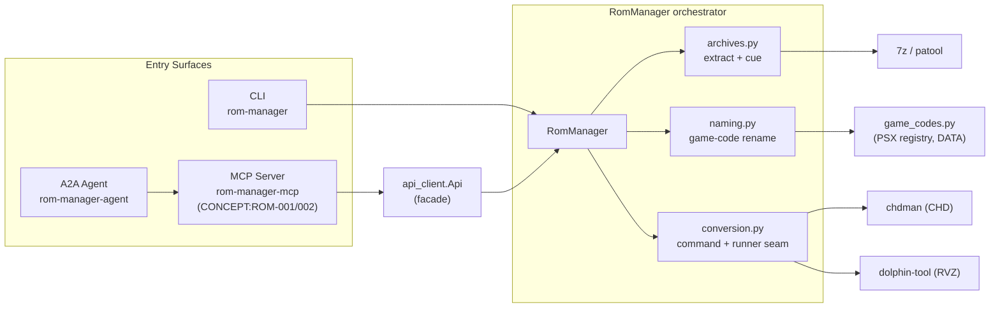

# ROM Manager
## CLI or API | MCP | Agent


*Version: 1.0.0*

> **Documentation** — Installation, deployment, and usage across the API, CLI, and
> MCP interfaces, plus the integrated A2A agent server, are maintained in the
> [official documentation](https://knuckles-team.github.io/rom-manager/).

> ⚠️ **Back up your ROMs before working with this tool.** Conversion and the
> `--delete` / `clean_origin_files` options are destructive to source files.

---

## Table of Contents

- [Overview](#overview)
- [Key Features](#key-features)
- [Architecture](#architecture)
- [Usage (CLI or API)](#usage-cli-or-api)
- [MCP](#mcp)
- [Agent](#agent)
- [Environment Variables](#environment-variables)
- [Security & Governance](#security--governance)
- [External Binary Dependencies](#external-binary-dependencies)
- [Installation](#installation)
- [Deployment (agent_server.py)](#deployment-agent_serverpy)
- [Documentation](#documentation)
- [Contributing](#contributing)
- [License](#license)

---

## Overview

**ROM Manager** is a production-grade ROM converter/organizer with an integrated
Model Context Protocol (MCP) server and Agent-to-Agent (A2A) agent. It extracts
archives, auto-renames ROMs via a known game-code registry, converts ISO/WBFS
images to **CHD** (`chdman`) or **RVZ** (`dolphin-tool`), generates missing `.cue`
sheets, and cleans up source files — in parallel.

It also speaks to **[RomM](https://romm.app)** (`CONCEPT:ROM-003`) — a self-hosted
ROM *library server* — through a full REST client, so one `rom-manager` tool
manages both the files on disk (local conversion) and the web library (RomM).

The local conversion pipeline needs no service URL or credentials; the RomM
client is configured via `ROMM_*` environment variables.

---

## Key Features

- **Real conversion pipeline:** parallel extract → rename → convert (CHD/RVZ) → cleanup.
- **Full RomM REST client (`CONCEPT:ROM-003`):** complete coverage of the RomM API
  (roms, platforms, collections, saves, states, firmware, users, tasks, search,
  config, feeds, devices, …) with Basic/OAuth2 auth — one unified CLI and one
  action-routed MCP tool per resource group.
- **Consolidated Action-Routed MCP Tools:** togglable domains (`conversion`,
  `game-codes`, `romm-*`) minimize token overhead and IDE tool bloat.
- **Integrated Graph Agent:** built-in Pydantic-AI agent (AG-UI / ACP).
- **Native Telemetry & Tracing:** OpenTelemetry exports out of the box.
- **Lazy native deps:** archive backends are optional extras, imported only when used.

---

## Architecture

ROM Manager keeps a single, well-factored pipeline behind three entry surfaces
(CLI, MCP server, A2A agent). The orchestrator (`RomManager`) composes focused
responsibility layers and shells out to external conversion binaries:



| Layer | Module | Responsibility |
|-------|--------|----------------|
| Orchestrator | `rom_manager/rom_manager.py` | Pipeline composition + CLI (`RomManager`, `rom_manager()`). |
| Archives | `rom_manager/archives.py` | Archive detection, extraction, `.cue` generation. |
| Conversion | `rom_manager/conversion.py` | `chdman`/`dolphin-tool` command building + runner seam. |
| Naming | `rom_manager/naming.py` | Game-code lookup + in-place rename. |
| Data | `rom_manager/game_codes.py` | Verbatim PSX serial→title registry (DATA). |
| Facade | `rom_manager/api_client.py` | `Api` wrapper consumed by MCP tools/agent. |

---

## Usage (CLI or API)

This package wraps a local ROM conversion pipeline (`rom_manager.rom_manager.RomManager`).
Use it via the CLI or the `rom_manager.api_client.Api` facade.

```bash
rom-manager --directory "/games/PSX/" --iso chd --verbose
```

| Flag | Long | Description |
|------|------|-------------|
| `-c` | `--cpu-count` | Limit max CPUs for parallel processing |
| `-d` | `--directory` | Directory to process ROMs |
| `-i` | `--iso` | Conversion target: `rvz` or `chd` |
| `-f` | `--force` | Force overwrite of existing `.chd` files |
| `-v` | `--verbose` | Display all output messages |
| `-x` | `--delete` | Delete original files after processing |

Detailed API usage is in [docs/usage.md](docs/usage.md).

### RomM web library (`CONCEPT:ROM-003`)

The same `rom-manager` command manages a running RomM server. Set `ROMM_URL` and
credentials (`ROMM_USERNAME`/`ROMM_PASSWORD` or `ROMM_TOKEN`), then use
`rom-manager <resource> <action> [positionals] [--flag value …]`:

```bash
rom-manager roms list --platform_ids 7 --limit 50   # list/search ROMs
rom-manager roms get 123                             # positional id
rom-manager platforms list
rom-manager saves add --rom_id 5 --file_path ./game.srm
rom-manager tasks run scan                           # trigger a library scan
rom-manager stats                                    # server statistics
```

Resources map 1:1 to `RommApi` methods. The on-disk converter is reachable as
before (bare flags) or via the explicit `rom-manager convert …` alias. From
Python, use `rom_manager.get_romm_client()` → `RommApi`.

---

## MCP

This server utilizes dynamic Action-Routed tools to optimize token overhead and
maximize IDE compatibility.

### Available MCP Tools
| Tool Module | Toggle Env Var | Enabled by Default | Description & Actions |
|-------------|----------------|--------------------|------------------------|
| **Conversion** | `CONVERSIONTOOL` | `True` | Manage ROM conversion operations (CONCEPT:ROM-001). Actions: `convert`, `process_directory`, `process_file`, `generate_cue`, `list_files`. |
| **Game Codes** | `GAMECODESTOOL` | `True` | Manage game code lookup and naming (CONCEPT:ROM-002). Actions: `lookup`, `list`, `rename`. |
| **RomM** (`romm_roms`, `romm_platforms`, `romm_collections`, `romm_saves`, `romm_states`, `romm_screenshots`, `romm_firmware`, `romm_users`, `romm_tasks`, `romm_search`, `romm_config`, `romm_feeds`, `romm_devices`, `romm_system`) | `ROMMTOOL` | `True` | RomM remote-library API (CONCEPT:ROM-003). One action-routed tool per resource group; each `action` maps to a `RommApi` method, with kwargs in `params_json`. Requires `ROMM_URL` + credentials. |

### Dynamic Tool Selection

Each domain is gated by an environment toggle (default `True`). Set a toggle to
`False` to omit that tool from the registered surface.

### Running the MCP server

```bash
# stdio (default)
rom-manager-mcp

# Streamable HTTP
rom-manager-mcp --transport streamable-http --host 0.0.0.0 --port 8000
```

#### stdio client config

```json
{
  "mcpServers": {
    "rom-manager": {
      "command": "uv",
      "args": ["run", "rom-manager-mcp"],
      "env": { "ROM_DIRECTORY": "/games", "CONVERSIONTOOL": "True", "GAMECODESTOOL": "True" }
    }
  }
}
```

#### Docker

```bash
docker run --rm -it -v /games:/games -e ROM_DIRECTORY=/games \
  -p 8000:8000 -e TRANSPORT=streamable-http knucklessg1/rom-manager:latest
```

---

<!-- BEGIN GENERATED: additional-deployment-options -->
### Additional Deployment Options

`rom-manager` can also run as a **local container** (Docker / Podman / `uv`) or be
consumed from a **remote deployment**. The
[Deployment guide](https://knuckles-team.github.io/rom-manager/deployment/) has full, copy-paste
`mcp_config.json` for all four transports — **stdio**, **streamable-http**,
**local container / uv**, and **remote URL**:

- **Local container / uv** — launch the server from `mcp_config.json` via `uvx`,
  `docker run`, or `podman run`, or point at a local streamable-http container by `url`.
- **Remote URL** — connect to a server deployed behind Caddy at
  `http://rom-manager-mcp.arpa/mcp` using the `"url"` key.
<!-- END GENERATED: additional-deployment-options -->

## Agent

ROM Manager ships a Pydantic-AI agent (`rom-manager-agent`) that calls the MCP
tool surface and exposes an AG-UI web interface. Its identity lives in
`rom_manager/agent_data/IDENTITY.md`.

```bash
rom-manager-agent --web
```

---

## Environment Variables

All settings are optional — ROM Manager runs with sensible defaults and requires
no credentials. Copy [`.env.example`](.env.example) to `.env` to override.

### Application Variables

| Variable | Default | Description |
|----------|---------|-------------|
| `ROM_DIRECTORY` | `.` (cwd) | Default directory of ROMs to process when none is supplied. |
| `ROM_ISO_TYPE` | `chd` | Conversion target: `chd` (chdman) or `rvz` (dolphin-tool). |
| `ROM_VERBOSE` | `False` | Emit verbose conversion output. |
| `ROM_FORCE` | `False` | Force overwrite of existing converted files. |
| `CONVERSIONTOOL` | `True` | Toggle registration of the **conversion** MCP tool domain (`CONCEPT:ROM-001`). |
| `GAMECODESTOOL` | `True` | Toggle registration of the **game-codes** MCP tool domain (`CONCEPT:ROM-002`). |
| `ROMMTOOL` | `True` | Toggle registration of the **RomM** MCP tool domains (`CONCEPT:ROM-003`). |

> CPU count and "delete originals" are exposed as CLI flags (`--cpu-count` /
> `--delete`) and MCP action params (`cpu_count` / `clean_origin_files`) rather
> than environment variables.

### RomM Variables (`CONCEPT:ROM-003`)

Required only when using RomM (`roms`, `platforms`, … commands / `romm_*` tools).

| Variable | Default | Description |
|----------|---------|-------------|
| `ROMM_URL` | — | Base URL of the RomM instance (e.g. `http://host:3000`). **Required** for RomM. |
| `ROMM_USERNAME` / `ROMM_PASSWORD` | — | Basic or OAuth password-grant credentials. |
| `ROMM_TOKEN` | — | Pre-minted OAuth2 bearer token (takes precedence over username/password). |
| `ROMM_AUTH_MODE` | `basic` | `basic` (no expiry) or `oauth` (password grant via `/api/token`, auto-refresh). |
| `ROMM_SCOPES` | RomM full set | Space-separated OAuth scopes requested when minting a token. |
| `ROMM_SSL_VERIFY` | `True` | Verify TLS certificates. |

### MCP / Framework Variables (agent-utilities)

| Variable | Default | Description |
|----------|---------|-------------|
| `HOST` | `0.0.0.0` | Bind host for HTTP/SSE transports. |
| `PORT` | `8000` | Bind port for HTTP/SSE transports. |
| `TRANSPORT` | `stdio` | MCP transport: `stdio`, `streamable-http`, or `sse`. |
| `AUTH_TYPE` | `none` | MCP authentication mode (this local tool needs none). |
| `FASTMCP_LOG_LEVEL` | `ERROR` | FastMCP internal log verbosity (pinned at startup). |
| `ENABLE_OTEL` | `True` | Enable OpenTelemetry export of traces/metrics. |
| `EUNOMIA_TYPE` | `none` | Eunomia authorization mode: `none`, `embedded`, or `remote`. |
| `EUNOMIA_POLICY_FILE` | `mcp_policies.json` | Path to the Eunomia policy file when embedded. |

### Terminal Variables

These are set automatically by the server to keep stdio transport clean; you do
not normally set them yourself.

| Variable | Default | Description |
|----------|---------|-------------|
| `NO_COLOR` | `1` | Disable ANSI colour codes in child tooling output. |
| `TERM` | `dumb` | Force a dumb terminal so progress output does not corrupt the stdio channel. |

---

## Security & Governance

- **No credentials:** ROM Manager is a local tool with no service URL/token.
- **Eunomia policies & OpenTelemetry:** inherited from the `agent-utilities`
  middleware (see `.env.example`).
- **Destructive-op safety:** the agent recommends backing up ROMs before
  `clean_origin_files`/delete operations.

---

## External Binary Dependencies

Conversion *actions* shell out to native tools (the Python package installs fine
without them):

- **`chdman`** (CHD) — `apt install mame-tools` (Ubuntu) or MAME tools on Windows.
- **`dolphin-tool`** (RVZ) — see the Dolphin emulator docs.
- **`7z` / archive backends** (extraction) — `apt install p7zip-full`; pair with
  the `rom-manager[native]` extra (`patool`).

---

## Installation

```bash
pip install rom-manager            # core CLI + Api
pip install "rom-manager[mcp]"     # + MCP server
pip install "rom-manager[agent]"   # + A2A agent
pip install "rom-manager[native]"  # + patool (archive extraction)
pip install "rom-manager[all]"     # everything
```

---

## Deployment (agent_server.py)

`rom-manager-agent` (entry point `rom_manager.agent_server:agent_server`) starts a
Pydantic-AI A2A agent that auto-discovers the MCP tool surface from
`mcp_config.json` and can expose an AG-UI web interface.

```bash
# Local: web UI on the default host/port, OTEL enabled
rom-manager-agent --web --otel \
  --provider openai --model-id gpt-4o-mini \
  --host 0.0.0.0 --port 8080
```

Container deployment (compose):

```yaml
# docker/agent.compose.yml (excerpt)
services:
  rom-manager-agent:
    image: knucklessg1/rom-manager:latest
    command: ["rom-manager-agent", "--web"]
    environment:
      ROM_DIRECTORY: /games
      TRANSPORT: streamable-http
      HOST: 0.0.0.0
      PORT: 8080
      ENABLE_OTEL: "True"
      AUTH_TYPE: none
    volumes:
      - /srv/roms:/games
    ports:
      - "8080:8080"
```

The MCP server (`rom-manager-mcp`) deploys the same way; see
[docs/deployment.md](docs/deployment.md) for the full compose/Swarm recipes.

---

## Documentation

- [Installation](docs/installation.md)
- [Deployment](docs/deployment.md)
- [Usage (API / CLI / MCP)](docs/usage.md)
- [Overview](docs/overview.md)
- [Concepts (`CONCEPT:ROM-*`)](docs/concepts.md)

---

## Contributing

Contributions are welcome. Run `pre-commit run --all-files` before opening a PR.
Preserve the real conversion pipeline — wrap `RomManager`, do not break it.

## License

MIT © Knuckles-Team
