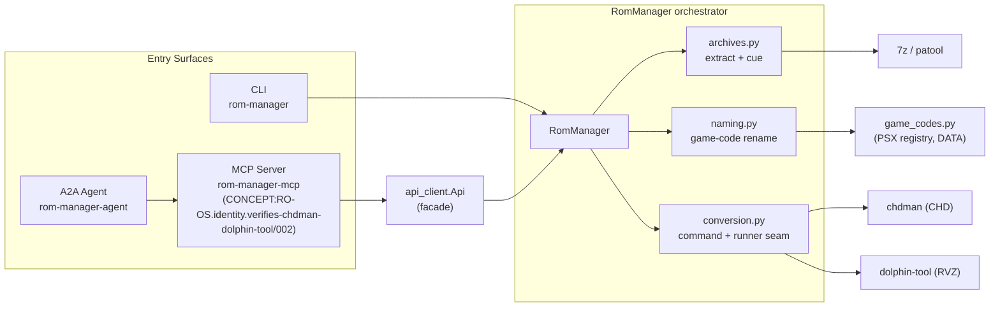

# ROM Manager
## CLI or API | MCP | Agent


*Version: 3.0.0*

> **Documentation** — Installation, deployment, and usage across the API, CLI, and
> MCP interfaces, plus the integrated A2A agent server, are maintained in the
> [official documentation](https://knuckles-team.github.io/rom-manager/).

> ⚠️ **Back up your ROMs before working with this tool.** Conversion and the
> `--delete` / `clean_origin_files` options are destructive to source files.

---

## Table of Contents

- [Overview](#overview)
- [Key Features](#key-features)
- [Architecture](#architecture)
- [Usage (CLI or API)](#usage-cli-or-api)
- [MCP](#mcp)
- [Agent](#agent)
- [Environment Variables](#environment-variables)
- [Security & Governance](#security--governance)
- [External Binary Dependencies](#external-binary-dependencies)
- [Installation](#installation)
- [Deployment (agent_server.py)](#deployment-agent_serverpy)
- [Documentation](#documentation)
- [Contributing](#contributing)
- [License](#license)

---

## Overview

**ROM Manager** is a production-grade ROM converter/organizer with an integrated
Model Context Protocol (MCP) server and Agent-to-Agent (A2A) agent. It extracts
archives, auto-renames ROMs via a known game-code registry, converts ISO/WBFS
images to **CHD** (`chdman`) or **RVZ** (`dolphin-tool`), generates missing `.cue`
sheets, and cleans up source files — in parallel.

It also speaks to **[RomM](https://romm.app)** (`CONCEPT:RO-OS.state.api-base-one-mixin`) — a self-hosted
ROM *library server* — through a full REST client, so one `rom-manager` tool
manages both the files on disk (local conversion) and the web library (RomM).

The local conversion pipeline needs no service URL or credentials; the RomM
client is configured via `ROMM_*` environment variables.

---

## Key Features

- **Real conversion pipeline:** parallel extract → rename → convert (CHD/RVZ) → cleanup.
- **Full RomM REST client (`CONCEPT:RO-OS.state.api-base-one-mixin`):** complete coverage of the RomM API
  (roms, platforms, collections, saves, states, firmware, users, tasks, search,
  config, feeds, devices, …) with Basic/OAuth2 auth — one unified CLI and one
  action-routed MCP tool per resource group.
- **Consolidated Action-Routed MCP Tools:** togglable domains (`conversion`,
  `game-codes`, `romm-*`) minimize token overhead and IDE tool bloat.
- **Integrated Graph Agent:** built-in Pydantic-AI agent (AG-UI / ACP).
- **Native Telemetry & Tracing:** OpenTelemetry exports out of the box.
- **Lazy native deps:** archive backends are optional extras, imported only when used.

---

## Architecture

ROM Manager keeps a single, well-factored pipeline behind three entry surfaces
(CLI, MCP server, A2A agent). The orchestrator (`RomManager`) composes focused
responsibility layers and shells out to external conversion binaries:


```mermaid
flowchart LR
    subgraph Entry["Entry Surfaces"]
        CLI["CLI<br/>rom-manager"]
        MCP["MCP Server<br/>rom-manager-mcp<br/>(CONCEPT:RO-OS.identity.verifies-chdman-dolphin-tool/002)"]
        AGENT["A2A Agent<br/>rom-manager-agent"]
    end

    CLI --> RM
    MCP --> API["api_client.Api<br/>(facade)"]
    AGENT --> MCP
    API --> RM

    subgraph Pipeline["RomManager orchestrator"]
        RM["RomManager"] --> ARCH["archives.py<br/>extract + cue"]
        RM --> NAME["naming.py<br/>game-code rename"]
        RM --> CONV["conversion.py<br/>command + runner seam"]
    end

    ARCH --> P7Z["7z / patool"]
    CONV --> CHDMAN["chdman (CHD)"]
    CONV --> DOLPHIN["dolphin-tool (RVZ)"]
    NAME --> CODES["game_codes.py<br/>(PSX registry, DATA)"]
```

| Layer | Module | Responsibility |
|-------|--------|----------------|
| Orchestrator | `rom_manager/rom_manager.py` | Pipeline composition + CLI (`RomManager`, `rom_manager()`). |
| Archives | `rom_manager/archives.py` | Archive detection, extraction, `.cue` generation. |
| Conversion | `rom_manager/conversion.py` | `chdman`/`dolphin-tool` command building + runner seam. |
| Naming | `rom_manager/naming.py` | Game-code lookup + in-place rename. |
| Data | `rom_manager/game_codes.py` | Verbatim PSX serial→title registry (DATA). |
| Facade | `rom_manager/api_client.py` | `Api` wrapper consumed by MCP tools/agent. |

---

## Usage (CLI or API)

This package wraps a local ROM conversion pipeline (`rom_manager.rom_manager.RomManager`).
Use it via the CLI or the `rom_manager.api_client.Api` facade.

```bash
rom-manager --directory "/games/PSX/" --iso chd --verbose
```

| Flag | Long | Description |
|------|------|-------------|
| `-c` | `--cpu-count` | Limit max CPUs for parallel processing |
| `-d` | `--directory` | Directory to process ROMs |
| `-i` | `--iso` | Conversion target: `rvz` or `chd` |
| `-f` | `--force` | Force overwrite of existing `.chd` files |
| `-v` | `--verbose` | Display all output messages |
| `-x` | `--delete` | Delete original files after processing |

Detailed API usage is in [docs/usage.md](docs/usage.md).

### RomM web library (`CONCEPT:RO-OS.state.api-base-one-mixin`)

The same `rom-manager` command manages a running RomM server. Set `ROMM_URL` and
credentials (`ROMM_USERNAME`/`ROMM_PASSWORD` or `ROMM_TOKEN`), then use
`rom-manager <resource> <action> [positionals] [--flag value …]`:

```bash
rom-manager roms list --platform_ids 7 --limit 50   # list/search ROMs
rom-manager roms get 123                             # positional id
rom-manager platforms list
rom-manager saves add --rom_id 5 --file_path ./game.srm
rom-manager tasks run scan                           # trigger a library scan
rom-manager stats                                    # server statistics
```

Resources map 1:1 to `RommApi` methods. The on-disk converter is reachable as
before (bare flags) or via the explicit `rom-manager convert …` alias. From
Python, use `rom_manager.get_romm_client()` → `RommApi`.

---

## MCP

This server utilizes dynamic Action-Routed tools to optimize token overhead and
maximize IDE compatibility.

### Available MCP Tools

The table below is auto-generated from the MCP server — do not edit by hand.

<!-- MCP-TOOLS-TABLE:START -->

#### Condensed action-routed tools (default — `MCP_TOOL_MODE=condensed`)

| MCP Tool | Toggle Env Var | Description |
|----------|----------------|-------------|
| `rom_conversion` | `CONVERSIONTOOL` | Manage ROM conversion operations (CONCEPT:RO-OS.identity.verifies-chdman-dolphin-tool). |
| `rom_game_codes` | `GAME_CODESTOOL` | Manage ROM game code lookup and naming operations (CONCEPT:RO-OS.governance.game-codes-naming-resolves). |
| `romm_collections` | `ROMMTOOL` |  |
| `romm_config` | `ROMMTOOL` |  |
| `romm_devices` | `ROMMTOOL` |  |
| `romm_feeds` | `ROMMTOOL` |  |
| `romm_firmware` | `ROMMTOOL` |  |
| `romm_platforms` | `ROMMTOOL` |  |
| `romm_roms` | `ROMMTOOL` |  |
| `romm_saves` | `ROMMTOOL` |  |
| `romm_screenshots` | `ROMMTOOL` |  |
| `romm_search` | `ROMMTOOL` |  |
| `romm_states` | `ROMMTOOL` |  |
| `romm_system` | `ROMMTOOL` |  |
| `romm_tasks` | `ROMMTOOL` |  |
| `romm_users` | `ROMMTOOL` |  |

#### Verbose 1:1 API-mapped tools (`MCP_TOOL_MODE=verbose` or `both`)

<details>
<summary>8 per-operation tools — one per public API method (click to expand)</summary>

| MCP Tool | Toggle Env Var | Description |
|----------|----------------|-------------|
| `rom_manager_convert` | `APITOOL` | Run the full parallel conversion pipeline over a directory (CONCEPT:RO-OS.identity.verifies-chdman-dolphin-tool). |
| `rom_manager_generate_cue` | `APITOOL` | Generate a missing ``.cue`` sheet for ``.bin`` tracks in a directory. |
| `rom_manager_list_files` | `APITOOL` | List ROM/archive files under a directory matching extensions. |
| `rom_manager_list_game_codes` | `APITOOL` | List known game codes, optionally filtered by a code prefix. |
| `rom_manager_lookup_game_code` | `APITOOL` | Look up a single game code -> name in the PSX code registry. |
| `rom_manager_process_directory` | `APITOOL` | Run the full parallel conversion pipeline over a directory (CONCEPT:RO-OS.identity.verifies-chdman-dolphin-tool). |
| `rom_manager_process_file` | `APITOOL` | Process a single ROM file through the conversion pipeline (CONCEPT:RO-OS.identity.verifies-chdman-dolphin-tool). |
| `rom_manager_rename_by_game_code` | `APITOOL` | Rename a file in-place using the embedded game code, if recognised. |

</details>

_16 action-routed tool(s) (default) · 8 verbose 1:1 tool(s). Each is enabled unless its `<DOMAIN>TOOL` toggle is set false; `MCP_TOOL_MODE` selects the surface (`condensed` default · `verbose` 1:1 · `both`). Auto-generated — do not edit._
<!-- MCP-TOOLS-TABLE:END -->

### Dynamic Tool Selection

Each domain is gated by an environment toggle (default `True`). Set a toggle to
`False` to omit that tool from the registered surface.

### Running the MCP server

```bash
# stdio (default)
rom-manager-mcp

# Streamable HTTP
rom-manager-mcp --transport streamable-http --host 0.0.0.0 --port 8000
```

> **Install the connector-focused `[mcp]` extra.** Examples use `rom-manager[mcp]` to add
> FastMCP / FastAPI through `agent-utilities[mcp]`; the required Agent Utilities core
> still carries `epistemic-graph[full]`. The `[agent]` extra additionally
> enables model orchestration.

#### stdio client config

```json
{
  "mcpServers": {
    "rom-manager": {
      "command": "uvx",
      "args": ["--from", "rom-manager[mcp]", "rom-manager-mcp"],
      "env": { "ROM_DIRECTORY": "/games", "CONVERSIONTOOL": "True", "GAME_CODESTOOL": "True" }
    }
  }
}
```

#### Docker

```bash
docker run --rm -it -v /games:/games -e ROM_DIRECTORY=/games \
  -p 8000:8000 -e TRANSPORT=streamable-http example/rom-manager:mcp
```

> The `:mcp` tag is the **MCP-serving image** (built from
> `docker/Dockerfile --target mcp`, installing `rom-manager[mcp]`). The default
> the immutable agent image is the **full agent image** (`--target agent`, `rom-manager[agent]`)
> which also bundles the Pydantic AI agent and the epistemic-graph engine — use it
> when you run `rom-manager-agent` (the agent), not just the MCP server. See
> [Container images](#container-images-mcp-vs-agent).

---

<!-- BEGIN GENERATED: additional-deployment-options -->
### Additional Deployment Options

`rom-manager` can run as a local stdio process or container, or behind a remote
network boundary. The
[Deployment guide](https://knuckles-team.github.io/rom-manager/deployment/) carries
the detailed transport contract.

- **Local container** — launch a reviewed immutable image as a least-privilege
  stdio child with no listener or published port.
- **Remote URL** — connect through an operator-supplied authenticated HTTPS
  ingress. Keep its URL, outbound identity references, trust profile, and exact
  `MCP_ALLOWED_HOSTS` in `AgentConfig`.
<!-- END GENERATED: additional-deployment-options -->

## Agent

ROM Manager ships a Pydantic-AI agent (`rom-manager-agent`) that calls the MCP
tool surface and exposes an AG-UI web interface. Its identity lives in
`rom_manager/agent_data/IDENTITY.md`.

```bash
rom-manager-agent --web
```

---

## Environment Variables

<!-- ENV-VARS-TABLE:START -->

#### Package environment variables

| Variable | Example | Description |
|----------|---------|-------------|
| `HOST` | `0.0.0.0` |  |
| `PORT` | `8000` |  |
| `TRANSPORT` | `stdio` | options: stdio, streamable-http, sse |
| `AUTH_TYPE` | `none` | Authentication mode for the MCP server (none for this local tool). |
| `FASTMCP_LOG_LEVEL` | `ERROR` | FastMCP internal log verbosity (the server pins this to ERROR at startup). |
| `NO_COLOR` | `1` | Disable ANSI colour output in child tooling. |
| `TERM` | `dumb` | Force a dumb terminal so progress bars / colour codes do not corrupt stdio. |
| `ENABLE_OTEL` | `True` |  |
| `OTEL_EXPORTER_OTLP_ENDPOINT` | `http://localhost:8080/api/public/otel` |  |
| `OTEL_EXPORTER_OTLP_PUBLIC_KEY` | `pk-...` |  |
| `OTEL_EXPORTER_OTLP_SECRET_KEY` | `sk-...` |  |
| `OTEL_EXPORTER_OTLP_PROTOCOL` | `http/protobuf` |  |
| `EUNOMIA_TYPE` | `none` | options: none, embedded, remote |
| `EUNOMIA_POLICY_FILE` | `mcp_policies.json` |  |
| `EUNOMIA_REMOTE_URL` | `http://eunomia-server:8000` |  |
| `ROM_DIRECTORY` | `./roms` | Default directory of ROMs to process when none is supplied. |
| `ROM_ISO_TYPE` | `chd` | Conversion target: chd (chdman) or rvz (dolphin-tool) |
| `ROM_VERBOSE` | `False` |  |
| `ROM_FORCE` | `False` |  |
| `ROMM_URL` | `http://localhost:3000` | any RomM (`roms`, `platforms`, ...) command or MCP tool. |
| `ROMM_USERNAME` | `admin` | Credentials: Basic/OAuth username+password, or a pre-minted bearer token. |
| `ROMM_PASSWORD` | `changeme` |  |
| `ROMM_TOKEN` | — |  |
| `ROMM_AUTH_MODE` | `basic` | Auth mode: basic (default, no expiry) or oauth (password grant via /api/token). |
| `ROMM_SCOPES` | `roms.read roms.write platforms.read` | Space-separated OAuth scopes (defaults to RomM's full read+write set). |
| `ROMM_TLS_PROFILE` | — | Named runtime TLS profile |
| `ROMM_TLS_PROFILE_REF` | — | Secret reference containing a TLS profile |
| `AUDIENCE` | `http://localhost:3000` | Target audience for the exchanged token (defaults to ROMM_URL). |
| `DELEGATED_SCOPES` | `roms.read` | Scopes requested for the delegated token. |
| `CONVERSIONTOOL` | `True` | MCP tools table (condensed action-routed surface). |
| `GAME_CODESTOOL` | `True` |  |
| `ROMMTOOL` | `True` | Master switch for the RomM remote-library tools. |

#### Inherited agent-utilities variables (apply to every connector)

| Variable | Example | Description |
|----------|---------|-------------|
| `MCP_TOOL_MODE` | `condensed` | Tool surface: `condensed` | `verbose` | `both` |
| `MCP_ENABLED_TOOLS` | — | Comma-separated tool allow-list |
| `MCP_DISABLED_TOOLS` | — | Comma-separated tool deny-list |
| `MCP_ENABLED_TAGS` | — | Comma-separated tag allow-list |
| `MCP_DISABLED_TAGS` | — | Comma-separated tag deny-list |
| `MCP_CLIENT_AUTH` | — | Outbound MCP auth (`oidc-client-credentials` for fleet calls) |
| `OIDC_CLIENT_ID` | — | OIDC client id (service-account auth) |
| `OIDC_CLIENT_SECRET` | — | OIDC client secret (service-account auth) |
| `DEBUG` | `False` | Verbose logging |
| `PYTHONUNBUFFERED` | `1` | Unbuffered stdout (recommended in containers) |
| `MCP_URL` | `http://localhost:8000/mcp` | URL of the MCP server the agent connects to |
| `PROVIDER` | `openai` | LLM provider for the agent |
| `MODEL_ID` | `gpt-4o` | Model id for the agent |
| `ENABLE_WEB_UI` | `True` | Serve the AG-UI web interface |

_31 package + 14 inherited variable(s). Auto-generated from `.env.example` + the shared agent-utilities set — do not edit._
<!-- ENV-VARS-TABLE:END -->


All settings are optional — ROM Manager runs with sensible defaults and requires
no credentials. Copy [`.env.example`](.env.example) to `.env` to override.

### Application Variables

| Variable | Default | Description |
|----------|---------|-------------|
| `ROM_DIRECTORY` | `.` (cwd) | Default directory of ROMs to process when none is supplied. |
| `ROM_ISO_TYPE` | `chd` | Conversion target: `chd` (chdman) or `rvz` (dolphin-tool). |
| `ROM_VERBOSE` | `False` | Emit verbose conversion output. |
| `ROM_FORCE` | `False` | Force overwrite of existing converted files. |
| `CONVERSIONTOOL` | `True` | Toggle registration of the **conversion** MCP tool domain (`CONCEPT:RO-OS.identity.verifies-chdman-dolphin-tool`). |
| `GAME_CODESTOOL` | `True` | Toggle registration of the **game-codes** MCP tool domain (`CONCEPT:RO-OS.governance.game-codes-naming-resolves`). |
| `ROMMTOOL` | `True` | Toggle registration of the **RomM** MCP tool domains (`CONCEPT:RO-OS.state.api-base-one-mixin`). |

> CPU count and "delete originals" are exposed as CLI flags (`--cpu-count` /
> `--delete`) and MCP action params (`cpu_count` / `clean_origin_files`) rather
> than environment variables.

### RomM Variables (`CONCEPT:RO-OS.state.api-base-one-mixin`)

Required only when using RomM (`roms`, `platforms`, … commands / `romm_*` tools).

| Variable | Default | Description |
|----------|---------|-------------|
| `ROMM_URL` | — | Base URL of the RomM instance (e.g. `http://host:3000`). **Required** for RomM. |
| `ROMM_USERNAME` / `ROMM_PASSWORD` | — | Basic or OAuth password-grant credentials. |
| `ROMM_TOKEN` | — | Pre-minted OAuth2 bearer token (takes precedence over username/password). |
| `ROMM_AUTH_MODE` | `basic` | `basic` (no expiry) or `oauth` (password grant via `/api/token`, auto-refresh). |
| `ROMM_SCOPES` | RomM full set | Space-separated OAuth scopes requested when minting a token. |
| `ROMM_TLS_PROFILE` | — | Named TLS profile for private PKI, mTLS, or proxy policy. |
| `ROMM_TLS_PROFILE_REF` | — | Secret reference containing the TLS profile. |

### MCP / Framework Variables (agent-utilities)

| Variable | Default | Description |
|----------|---------|-------------|
| `HOST` | `0.0.0.0` | Bind host for HTTP/SSE transports. |
| `PORT` | `8000` | Bind port for HTTP/SSE transports. |
| `TRANSPORT` | `stdio` | MCP transport: `stdio`, `streamable-http`, or `sse`. |
| `AUTH_TYPE` | `none` | MCP authentication mode (this local tool needs none). |
| `FASTMCP_LOG_LEVEL` | `ERROR` | FastMCP internal log verbosity (pinned at startup). |
| `ENABLE_OTEL` | `True` | Enable OpenTelemetry export of traces/metrics. |
| `EUNOMIA_TYPE` | `none` | Eunomia authorization mode: `none`, `embedded`, or `remote`. |
| `EUNOMIA_POLICY_FILE` | `mcp_policies.json` | Path to the Eunomia policy file when embedded. |

### Terminal Variables

These are set automatically by the server to keep stdio transport clean; you do
not normally set them yourself.

| Variable | Default | Description |
|----------|---------|-------------|
| `NO_COLOR` | `1` | Disable ANSI colour codes in child tooling output. |
| `TERM` | `dumb` | Force a dumb terminal so progress output does not corrupt the stdio channel. |

---

## Security & Governance

- **No credentials:** ROM Manager is a local tool with no service URL/token.
- **Eunomia policies & OpenTelemetry:** inherited from the `agent-utilities`
  middleware (see `.env.example`).
- **Destructive-op safety:** the agent recommends backing up ROMs before
  `clean_origin_files`/delete operations.

---

## External Binary Dependencies

Conversion *actions* shell out to native tools (the Python package installs fine
without them):

- **`chdman`** (CHD) — `apt install mame-tools` (Ubuntu) or MAME tools on Windows.
- **`dolphin-tool`** (RVZ) — see the Dolphin emulator docs.
- **`7z` / archive backends** (extraction) — `apt install p7zip-full`; pair with
  the `rom-manager[native]` extra (`patool`).

---

## Installation

Pick the extra that matches what you want to run:

| Extra | Installs | Use when |
|-------|----------|----------|
| `rom-manager` (core) | CLI converter + `Api` facade (no server tooling) | You only use the **CLI / Python API** |
| `rom-manager[mcp]` | Connector-focused MCP server (`agent-utilities[mcp]` — FastMCP/FastAPI + `epistemic-graph[full]`) | You run the **MCP server** (smallest server install / image) |
| `rom-manager[agent]` | Agent runtime (`agent-utilities[agent-runtime,logfire]` — model orchestration + `epistemic-graph[full]`) | You run the **integrated agent** |
| `rom-manager[native]` | + `patool` (archive extraction backends) | You convert archived ROMs locally |
| `rom-manager[all]` | Everything (`mcp` + `agent` + `native` + `otel`) | Development / all surfaces |

```bash
pip install rom-manager            # core CLI + Api
pip install "rom-manager[mcp]"     # + MCP server
pip install "rom-manager[agent]"   # + A2A agent (Pydantic AI + epistemic-graph engine)
pip install "rom-manager[native]"  # + patool (archive extraction)
pip install "rom-manager[all]"     # everything
```

### Container images (`:mcp` vs `:agent`)

One multi-stage `docker/Dockerfile` builds two right-sized images, selected by `--target`:

| Image tag | Build target | Contents | Entrypoint |
|-----------|--------------|----------|------------|
| `example/rom-manager:mcp` | `--target mcp` | `rom-manager[mcp]` — **connector-focused**, includes `epistemic-graph[full]`; no model-orchestration stack | `rom-manager-mcp` |
| `example/rom-manager@sha256:<digest>` | `--target agent` (default) | `rom-manager[agent]` — **agent runtime**, model orchestration + `epistemic-graph[full]` | `rom-manager-agent` |

```bash
docker build --target mcp   -t example/rom-manager:mcp    docker/   # connector-focused MCP server
docker build --target agent -t example/rom-manager:agent-local docker/   # agent runtime
```

`docker/mcp.compose.yml` runs the connector-focused `:mcp` server; `docker/agent.compose.yml` runs the
agent (`immutable agent digest`) with a co-located `:mcp` sidecar.

### Knowledge-graph database (`epistemic-graph`)

Both `[mcp]` and `[agent]` carry the **epistemic-graph** engine through the required
Agent Utilities core dependency (`epistemic-graph[full]`). The `[mcp]` extra keeps
the server connector-focused; `[agent]` additionally enables model orchestration. Local
deployments can use the bundled engine. For production or shared state, run
**epistemic-graph as a dedicated database service** and configure the runtime to use it.
Deployment recipes (single-node + Raft HA), connection configuration, and architecture
diagrams are documented in the
[epistemic-graph deployment guide](https://knuckles-team.github.io/epistemic-graph/deployment/).

---

## Deployment (agent_server.py)

`rom-manager-agent` (entry point `rom_manager.agent_server:agent_server`) starts a
Pydantic-AI A2A agent that auto-discovers the MCP tool surface from
`mcp_config.json` and can expose an AG-UI web interface.

```bash
# Local: web UI on the default host/port, OTEL enabled
rom-manager-agent --web --otel \
  --provider openai --model-id gpt-4o-mini \
  --host 0.0.0.0 --port 8080
```

Container deployment (compose):

```yaml
# docker/agent.compose.yml (excerpt)
services:
  rom-manager-agent:
    image: example/rom-manager@sha256:<digest>
    command: ["rom-manager-agent", "--web"]
    environment:
      ROM_DIRECTORY: /games
      TRANSPORT: streamable-http
      HOST: 0.0.0.0
      PORT: 8080
      ENABLE_OTEL: "True"
      AUTH_TYPE: none
    volumes:
      - /srv/roms:/games
    ports:
      - "8080:8080"
```

The MCP server (`rom-manager-mcp`) deploys the same way; see
[docs/deployment.md](docs/deployment.md) for the full compose/Swarm recipes.

---

## Documentation

- [Installation](docs/installation.md)
- [Deployment](docs/deployment.md)
- [Usage (API / CLI / MCP)](docs/usage.md)
- [Overview](docs/overview.md)
- [Concepts (`CONCEPT:ROM-*`)](docs/concepts.md)

---

## Contributing

Contributions are welcome. Run `pre-commit run --all-files` before opening a PR.
Preserve the real conversion pipeline — wrap `RomManager`, do not break it.

## License

MIT © Knuckles-Team


<!-- BEGIN agent-utilities-deployment (generated; do not edit between markers) -->

## Deploy with `agent-utilities-deployment`

Provision this package with the consolidated **`agent-utilities-deployment`**
workflow. It selects an installed-package, editable-source, or immutable-container
path; records only runtime secret and TLS-profile references in `AgentConfig`; and
runs doctor, registration, policy, observability, and rollback gates. Ask your agent
to **"deploy `rom-manager` with agent-utilities-deployment"**.

| Install mode | Command |
|------|---------|
| Installed package | `uv tool install "rom-manager[mcp]"`, then run `rom-manager-mcp` |
| Editable source | `uv pip install -e ".[agent]"`, then run `rom-manager-mcp` |
| Immutable container | deploy `registry.example.invalid/rom-manager@sha256:<digest>` through the operator-selected orchestrator |

The repository embeds no deployment profile, credential value, certificate path, or
environment-specific endpoint. Supply those at runtime through `AgentConfig` and the
configured secret provider.

<!-- END agent-utilities-deployment -->

<!-- GOVERNED-CAPABILITY:START -->
## Governed capability contract

This package ships a compact canonical skill surface with specialist procedures
kept as referenced workflows. The current MCP tools, skill metadata,
`connector_manifest.yml`, ontology, mappings, shapes, fixtures, migrations,
tool-schema fingerprints, and certification metadata form one versioned
capability contract. Validate them together; do not rely on stale tool names or
historical per-task skill wrappers.

Runtime endpoints, credentials, certificate trust, tenant identity, retention,
and observability policy are deployment inputs and are never packaged values.
See [Configuration, trust, and privacy](docs/configuration.md) before enabling a
network transport, connector ingestion, GraphOS delegation, or trace export.
<!-- GOVERNED-CAPABILITY:END -->
