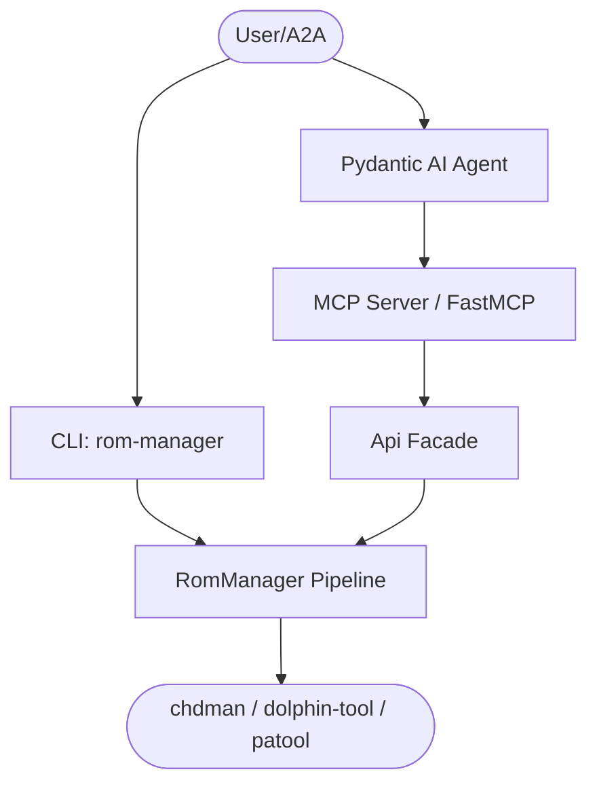

# Overview

`rom-manager` exposes a local ROM conversion pipeline through three surfaces: a
CLI, an action-routed MCP server, and a Pydantic-AI agent.

## Architecture

## Action-routed tool surface

Instead of one MCP tool per operation, `rom-manager` groups operations into two
consolidated, togglable domains. Each is a single tool that routes on an
`action` string with a `params_json` payload — minimizing tool count and token
overhead in LLM contexts.

| Domain | Tag | Toggle | Actions |
|--------|-----|--------|---------|
| ROM Conversion (`CONCEPT:ROM-001`) | `conversion` | `CONVERSIONTOOL` | `convert`, `process_directory`, `process_file`, `generate_cue`, `list_files` |
| Game Codes / Naming (`CONCEPT:ROM-002`) | `game-codes` | `GAMECODESTOOL` | `lookup`, `list`, `rename` |

## The conversion pipeline

`RomManager.process_parallel` walks a directory, then per file:

1. **Extract** archives (`.7z`, `.zip`, `.rar`, …) via `patool` (optional native extra).
2. **Generate** missing `.cue` sheets for `.bin` tracks.
3. **Rename** using the embedded game-code registry (`game_codes.psx_codes`).
4. **Convert** ISO/GDI/CUE → CHD (`chdman`) or WBFS/ISO → RVZ (`dolphin-tool`).
5. **Cleanup** extracted/origin files when requested.
